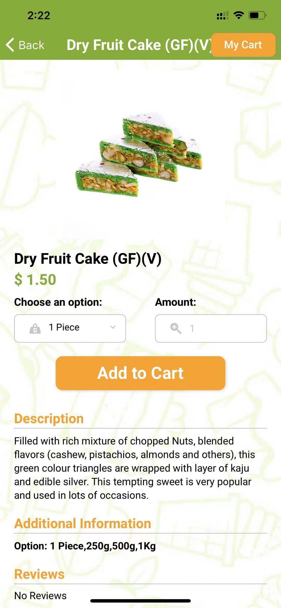

<!-- PROJECT LOGO -->
 

  

  <h1 align="center" >Sweet Utsav</h1>

  

    This is a mobile application for <a href="https://carolinesprings.sweetutsav.com.au/"><strong>Sweet Utsav</strong></a> implemented with React Native.
     
    <a href="https://apps.apple.com/cn/app/sweet-utsav/id1569121232?l=en"><strong>Explore on App Store »</strong></a>
     
    <a href="https://play.google.com/store/apps/details?id=com.sonia.sweetUtsav"><strong>Explore on Google Play »</strong></a>
  

## Description

This is a [React Native](https://reactnative.dev/) e-commerce mobile application supported by [WooCommerce](https://woocommerce.com/?aff=17277) Backend. 

## ScreenShots

  
  
  
  
  
  

## Usage
1. cd to the current dictionary and run following command to install required packages:

`npm install`

2. Use following command to run this app on Expo Metro Bundler:

`npm start`

